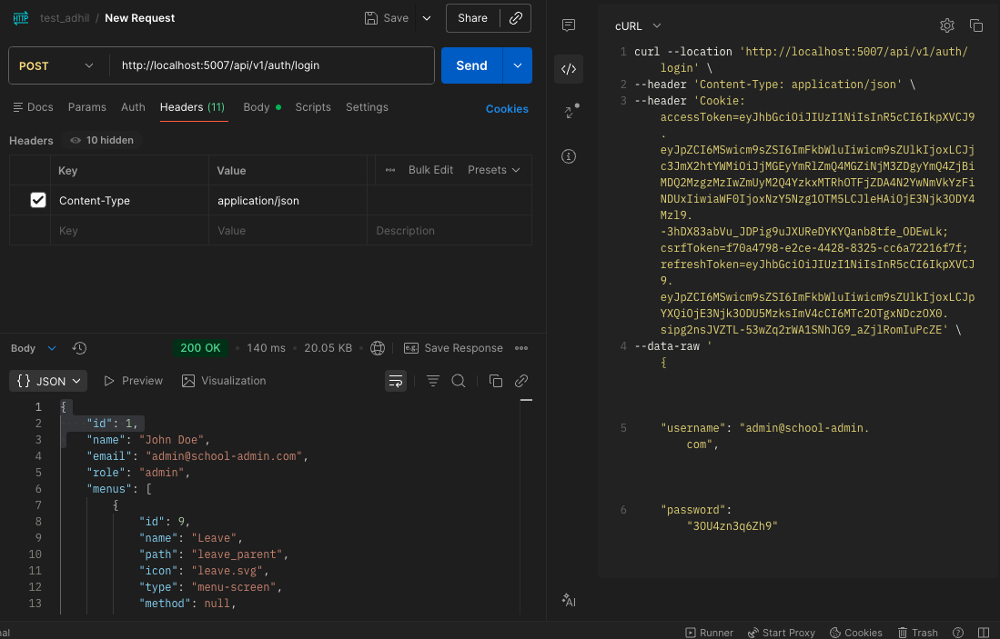
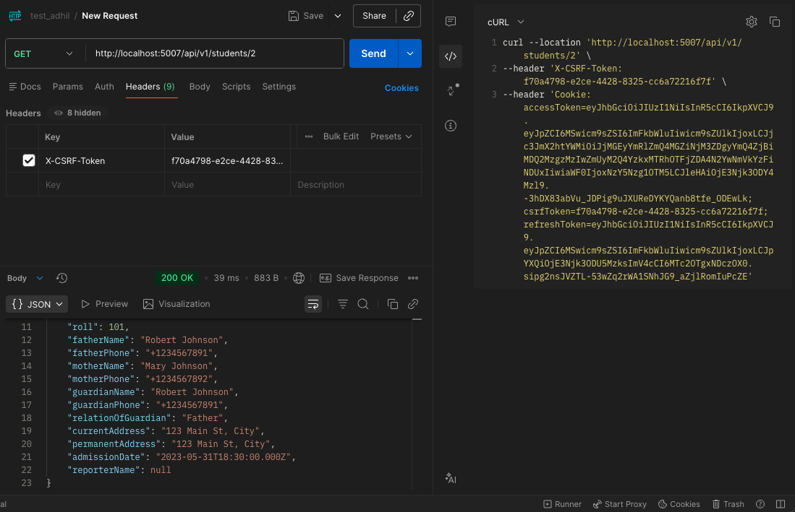
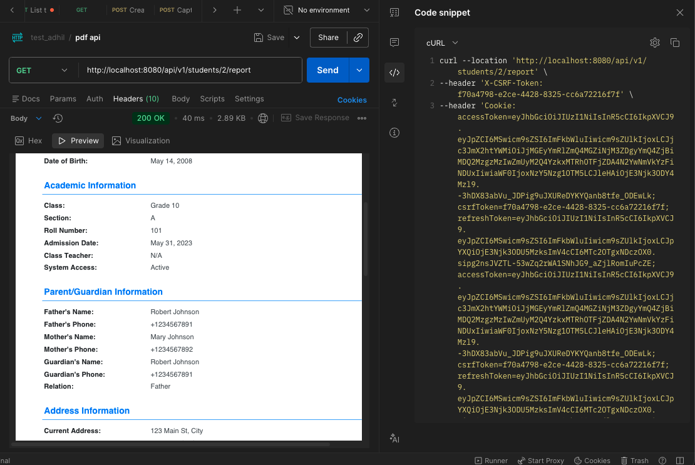

# Go PDF Report Generation Service - API Documentation

A microservice built in Go that generates PDF reports for students by consuming the Node.js backend API.

## Table of Contents

- [Overview](#overview)
- [Architecture](#architecture)
- [Prerequisites](#prerequisites)
- [Installation](#installation)
- [Configuration](#configuration)
- [API Endpoints](#api-endpoints)
- [Authentication Flow](#authentication-flow)
- [Features](#features)
- [Testing Guide](#testing-guide)
- [Screenshots](#screenshots)
- [Troubleshooting](#troubleshooting)

---

## Overview

This Go microservice provides PDF report generation for students. It:

1. Receives requests at `GET /api/v1/students/:id/report`
2. Fetches student data from the Node.js backend API
3. Generates a formatted PDF report
4. Returns the PDF as a downloadable file

**Key Features:**
- In-memory caching to reduce backend API calls
- Token bucket rate limiting for abuse protection
- Cookie-based authentication forwarding
- Graceful shutdown with resource cleanup

---

## Architecture

```
┌─────────────────┐     ┌─────────────────┐     ┌─────────────────┐
│                 │     │                 │     │                 │
│     Client      │────▶│   Go Service    │────▶│  Node.js API    │
│   (Postman)     │     │   (Port 8080)   │     │  (Port 5007)    │
│                 │◀────│                 │◀────│                 │
└─────────────────┘     └─────────────────┘     └─────────────────┘
       │                        │                       │
       │                        ▼                       ▼
       │                 ┌─────────────┐         ┌─────────────┐
       │                 │    Cache    │         │  PostgreSQL │
       │                 │  (In-Memory)│         │   Database  │
       │                 └─────────────┘         └─────────────┘
       │
       ▼
  ┌─────────────┐
  │  PDF File   │
  │  (Download) │
  └─────────────┘
```

### Project Structure

```
go-service/
├── cmd/server/
│   └── main.go                  # Application entry point
├── internal/
│   ├── cache/
│   │   └── cache.go             # Thread-safe in-memory cache with TTL
│   ├── config/
│   │   └── config.go            # Environment-based configuration
│   ├── handlers/
│   │   └── report_handler.go    # HTTP request handlers
│   ├── middleware/
│   │   └── ratelimit.go         # Rate limiting middleware
│   ├── models/
│   │   └── student.go           # Data models
│   ├── ratelimiter/
│   │   └── ratelimiter.go       # Token bucket rate limiter
│   └── services/
│       ├── pdf_service.go       # PDF generation logic
│       └── student_service.go   # Node.js API client with caching
├── docs/
│   └── API.md                   # This documentation
├── screenshots/                 # Test screenshots
├── go.mod
├── go.sum
├── .env.example
└── README.md
```

---

## Prerequisites

| Requirement | Version | Purpose |
|-------------|---------|---------|
| Go | 1.21+ | Runtime for Go service |
| Node.js | 16+ | Backend API runtime |
| PostgreSQL | 12+ | Database |
| Postman/cURL | Any | API testing |

---

## Installation

### 1. Database Setup

```bash
# Install PostgreSQL (macOS with Homebrew)
brew install postgresql@15
brew services start postgresql@15

# Add to PATH
echo 'export PATH="/opt/homebrew/opt/postgresql@15/bin:$PATH"' >> ~/.zshrc
source ~/.zshrc

# Create and seed database
createdb school_mgmt
psql -d school_mgmt -f seed_db/tables.sql
psql -d school_mgmt -f seed_db/seed-db.sql
```

### 2. Backend Setup

```bash
cd backend

# Update .env for local PostgreSQL
# Change: DATABASE_URL=postgresql://YOUR_USERNAME@localhost:5432/school_mgmt

npm install
npm start
# Server runs on http://localhost:5007
```

### 3. Go Service Setup

```bash
cd go-service

# Install dependencies
go mod tidy

# Build (recommended for macOS)
CGO_ENABLED=0 go build -o pdf-service cmd/server/main.go

# Run
./pdf-service
# Server runs on http://localhost:8080
```

---

## Configuration

All settings via environment variables:

| Variable | Default | Description |
|----------|---------|-------------|
| `PORT` | `8080` | Go service port |
| `NODE_API_URL` | `http://localhost:5007` | Node.js backend URL |
| `CACHE_TTL_SECONDS` | `300` | Cache TTL (5 minutes) |
| `CACHE_CLEANUP_SECONDS` | `60` | Cache cleanup interval |
| `RATE_LIMIT_PER_SECOND` | `10` | Requests per second per client |
| `RATE_LIMIT_BURST` | `20` | Maximum burst size |

### Example

```bash
PORT=3000 RATE_LIMIT_PER_SECOND=5 ./pdf-service
```

---

## API Endpoints

### 1. Health Check

Check if the service is running.

| Property | Value |
|----------|-------|
| **URL** | `/health` |
| **Method** | `GET` |
| **Auth Required** | No |
| **Rate Limited** | No |

#### Response

```json
{
  "status": "healthy",
  "service": "go-pdf-service"
}
```

---

### 2. Generate Student PDF Report

Generate and download a PDF report for a specific student.

| Property | Value |
|----------|-------|
| **URL** | `/api/v1/students/:id/report` |
| **Method** | `GET` |
| **Auth Required** | Yes (Cookie + CSRF) |
| **Rate Limited** | Yes |

#### URL Parameters

| Parameter | Type | Required | Description |
|-----------|------|----------|-------------|
| `id` | integer | Yes | Student ID |

#### Headers

| Header | Required | Description |
|--------|----------|-------------|
| `Cookie` | Yes | Auth cookies from login (`accessToken`, `refreshToken`, `csrfToken`) |
| `X-CSRF-Token` | Yes | CSRF token value |

#### Success Response

| Property | Value |
|----------|-------|
| **Status** | `200 OK` |
| **Content-Type** | `application/pdf` |
| **Content-Disposition** | `attachment; filename=student_{id}_report.pdf` |
| **Body** | Binary PDF data |

#### Error Responses

| Status | Description |
|--------|-------------|
| `400 Bad Request` | Student ID is required |
| `401 Unauthorized` | Missing or invalid authentication |
| `404 Not Found` | Student not found |
| `429 Too Many Requests` | Rate limit exceeded |
| `500 Internal Server Error` | Server error |

#### Rate Limit Headers

| Header | Description |
|--------|-------------|
| `X-RateLimit-Remaining` | Remaining tokens |
| `Retry-After` | Seconds to wait (when rate limited) |

---

## Authentication Flow

The Node.js backend uses **cookie-based authentication with CSRF protection**. The Go service forwards these credentials.

```
┌─────────┐     POST /auth/login      ┌─────────────┐
│ Client  │ ─────────────────────────▶│ Node.js API │
│         │                           │             │
│         │◀───────────────────────── │             │
│         │  Set-Cookie: accessToken  │             │
│         │  Set-Cookie: refreshToken │             │
│         │  Set-Cookie: csrfToken    │             │
└─────────┘                           └─────────────┘
     │
     │  GET /api/v1/students/2/report
     │  Cookie: accessToken=...; refreshToken=...; csrfToken=...
     │  X-CSRF-Token: <csrfToken value>
     ▼
┌─────────────┐                       ┌─────────────┐
│ Go Service  │ ─────────────────────▶│ Node.js API │
│             │  Forward Cookies +    │             │
│             │  X-CSRF-Token         │             │
│             │◀───────────────────── │             │
│             │  Student JSON data    │             │
└─────────────┘                       └─────────────┘
     │
     │  Generate PDF
     ▼
┌─────────────┐
│  PDF File   │
│  (Download) │
└─────────────┘
```

---

## Features

### 1. In-Memory Caching

**Purpose:** Reduces load on Node.js backend and improves response times.

| Property | Value |
|----------|-------|
| **Storage** | In-memory map |
| **TTL** | 5 minutes (configurable) |
| **Concurrency** | `sync.RWMutex` (multiple readers, single writer) |
| **Cleanup** | Background goroutine removes expired entries |

**Cache Flow:**
```
Request → Check Cache → Hit? → Return cached data
                    ↓
                   Miss
                    ↓
          Fetch from Node.js API
                    ↓
           Store in cache
                    ↓
             Return data
```

### 2. Rate Limiting

**Purpose:** Protects against abuse and ensures fair usage.

| Property | Value |
|----------|-------|
| **Algorithm** | Token Bucket |
| **Rate** | 10 requests/second (configurable) |
| **Burst** | 20 requests (configurable) |
| **Key** | Client IP address |
| **Cleanup** | Removes inactive buckets after 10 minutes |

**How Token Bucket Works:**
- Each client has a "bucket" of tokens
- Tokens refill at a steady rate (10/sec)
- Each request consumes 1 token
- Requests denied when bucket is empty
- Burst allows temporary spikes

### 3. PDF Report Contents

The generated PDF includes:

| Section | Fields |
|---------|--------|
| **Header** | Title, generation timestamp |
| **Personal Information** | ID, Name, Email, Phone, Gender, DOB |
| **Academic Information** | Class, Section, Roll, Admission Date, Class Teacher, Status |
| **Parent/Guardian Info** | Father's name/phone, Mother's name/phone, Guardian details |
| **Address Information** | Current address, Permanent address |
| **Footer** | System-generated notice |

### 4. Graceful Shutdown

On SIGINT (Ctrl+C) or SIGTERM:
1. Stops accepting new requests
2. Stops cache cleanup goroutine
3. Stops rate limiter cleanup goroutine
4. Exits cleanly

---

## Testing Guide

### Step 1: Start All Services

```bash
# Terminal 1: Node.js Backend
cd backend && npm start

# Terminal 2: Go Service
cd go-service && ./pdf-service
```

### Step 2: Login (Get Auth Tokens)

**Postman:**
- Method: `POST`
- URL: `http://localhost:5007/api/v1/auth/login`
- Body (JSON):
```json
{
  "username": "admin@school-admin.com",
  "password": "3OU4zn3q6Zh9"
}
```

**cURL:**
```bash
curl -c cookies.txt -X POST http://localhost:5007/api/v1/auth/login \
  -H "Content-Type: application/json" \
  -d '{"username":"admin@school-admin.com","password":"3OU4zn3q6Zh9"}'
```

### Step 3: Get Student Data (Verify Auth)

**Postman:**
- Method: `GET`
- URL: `http://localhost:5007/api/v1/students/2`
- Headers:
  - `X-CSRF-Token`: `<csrfToken from cookies>`
- Cookies: Auto-sent from login

**cURL:**
```bash
CSRF=$(grep csrfToken cookies.txt | awk '{print $7}')
curl -b cookies.txt -H "X-CSRF-Token: $CSRF" \
  http://localhost:5007/api/v1/students/2
```

### Step 4: Generate PDF Report

**Postman:**
- Method: `GET`
- URL: `http://localhost:8080/api/v1/students/2/report`
- Headers:
  - `X-CSRF-Token`: `<csrfToken value>`
  - `Cookie`: `accessToken=...; refreshToken=...; csrfToken=...`

**cURL:**
```bash
curl -b cookies.txt -H "X-CSRF-Token: $CSRF" \
  http://localhost:8080/api/v1/students/2/report \
  --output student_report.pdf

# Open the PDF
open student_report.pdf
```

### Step 5: Test Rate Limiting

```bash
# Run 25 requests rapidly
for i in {1..25}; do
  curl -s -o /dev/null -w "%{http_code} " \
    -b cookies.txt -H "X-CSRF-Token: $CSRF" \
    http://localhost:8080/api/v1/students/2/report
done
```

Expected: First 20 return `200`, remaining return `429`.

---

## Screenshots

### 1. Login API Response


Shows successful login with user details and cookie tokens set.

### 2. Get Student API Response


Shows student data returned by Node.js API including personal, academic, and family information.

### 3. Generated PDF Report


Shows the formatted PDF report with all student information sections.

---

## Troubleshooting

| Error | Cause | Solution |
|-------|-------|----------|
| `connection refused :5007` | Node.js backend not running | Start backend: `npm start` |
| `connection refused :8080` | Go service not running | Start Go: `./pdf-service` |
| `401 Unauthorized` | Missing/expired auth tokens | Re-login to get fresh tokens |
| `403 Forbidden` | CSRF token mismatch | Use correct csrfToken value (UUID only) |
| `404 Not Found` | Student ID doesn't exist | Check database for valid IDs |
| `429 Too Many Requests` | Rate limit exceeded | Wait 1-2 seconds and retry |
| `dyld: missing LC_UUID` | macOS Go build issue | Use `CGO_ENABLED=0 go build` |

---

## Dependencies

| Package | Version | Purpose |
|---------|---------|---------|
| `github.com/gorilla/mux` | v1.8.1 | HTTP router |
| `github.com/jung-kurt/gofpdf` | v1.16.2 | PDF generation |

---

## License

MIT License - See project root for details.
